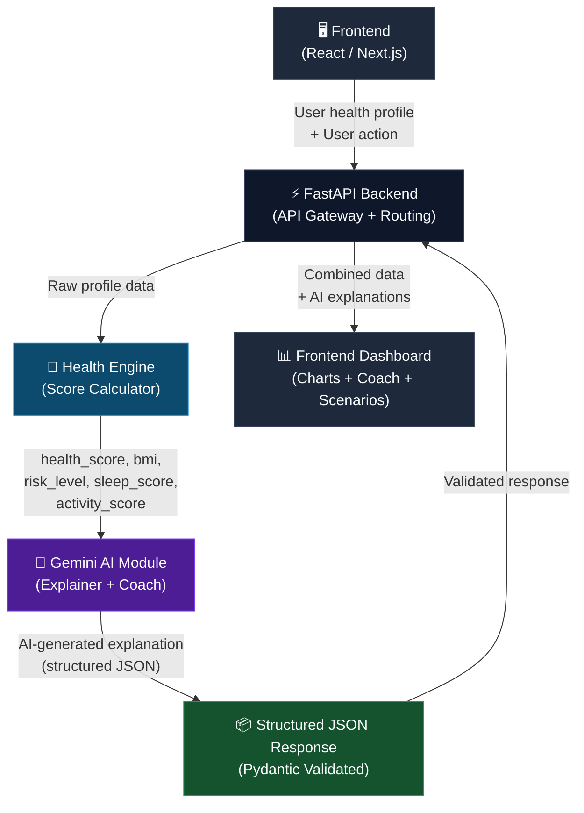
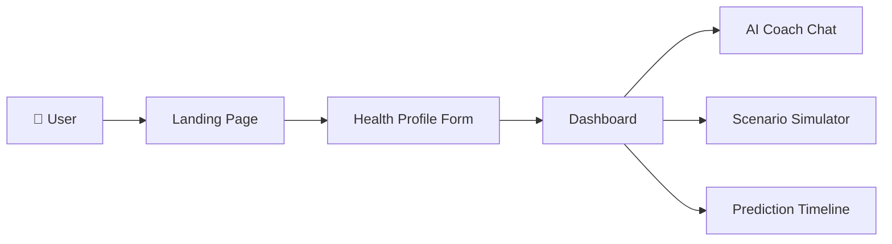
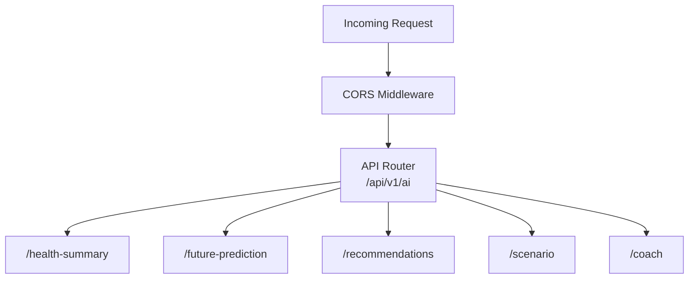
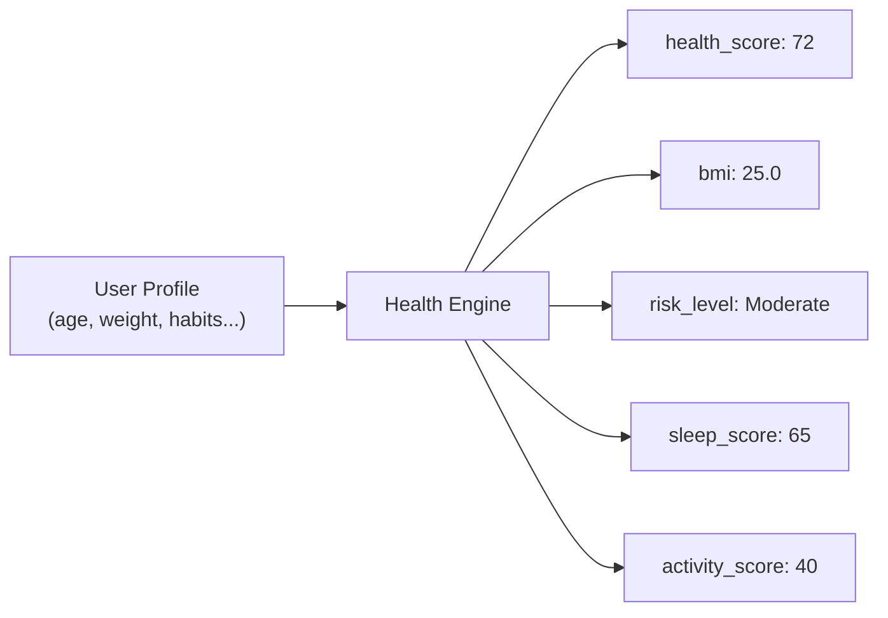
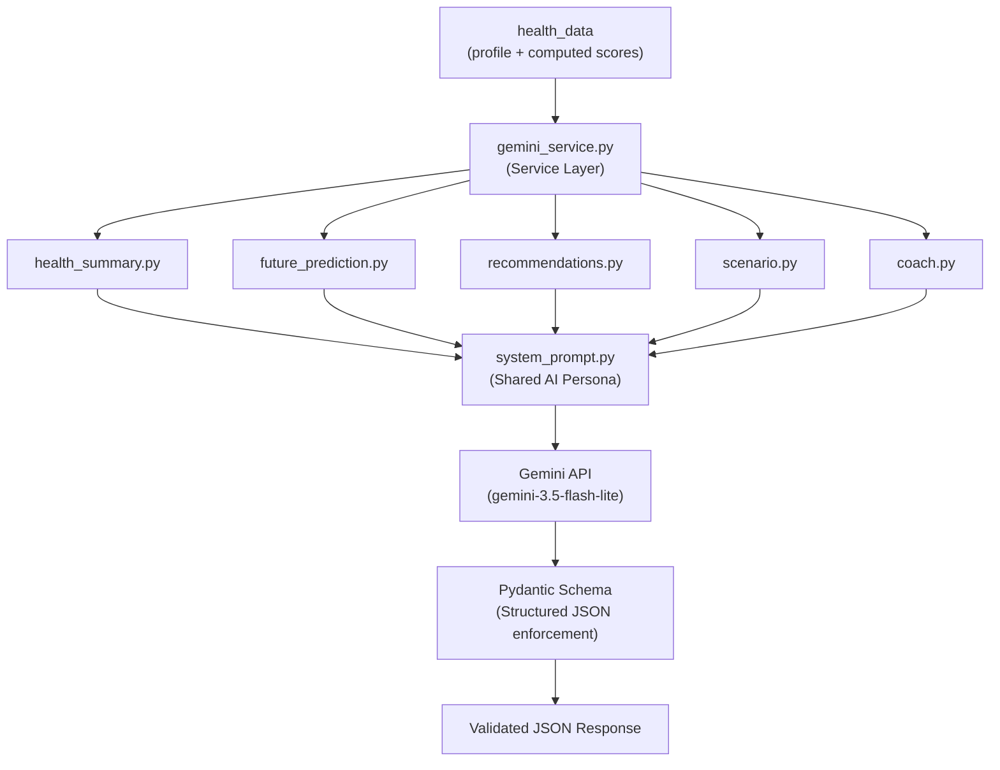
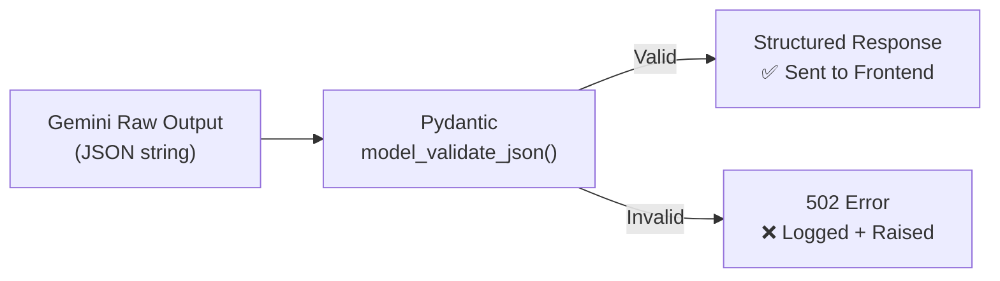
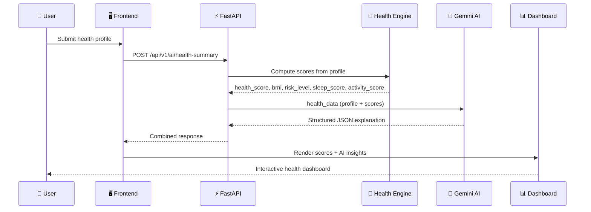
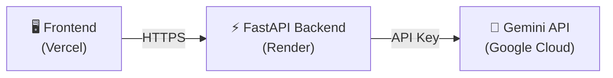

# 🏗 MediTwin AI — Project Architecture

This document describes the full system architecture of MediTwin AI — a Digital Health Twin platform that simulates, explains, and coaches users on their health using AI.

---

## System Overview

MediTwin AI is built as a decoupled, layered system where each component has a single, well-defined responsibility.



---

## Component Breakdown

---

### 1. 🖥 Frontend — User Interface

**Owner:** Vishesh

**Technology:** React / Next.js

The frontend is the entry point for the user. It collects the user's health profile through an onboarding form and communicates with the backend to display AI-powered health insights.

**Responsibilities:**
- Collect and submit the user's health profile
- Display the health dashboard (scores, charts, risk levels)
- Render AI-generated summaries and explanations
- Present the Future Prediction timeline
- Power the What-If Scenario Simulator UI
- Host the AI Health Coach chat interface
- Handle responsive design across devices



---

### 2. ⚡ FastAPI Backend — API Gateway

**Owner:** Lakshya

**Technology:** Python, FastAPI, Uvicorn

The FastAPI backend is the central orchestration layer. It receives requests from the frontend, routes them to the correct service (Health Engine or Gemini AI), and returns unified responses.

**Responsibilities:**
- Expose REST API endpoints (`/api/v1/ai/*`)
- Validate incoming requests via Pydantic
- Orchestrate calls between the Health Engine and Gemini AI Module
- Apply CORS policies for the frontend
- Serve auto-generated API documentation (`/docs`, `/redoc`)
- Handle errors and HTTP status codes



---

### 3. 🏥 Health Engine — Score Calculator

**Owner:** Lakshya

**Technology:** Python (custom engine)

The Health Engine is the mathematical brain of MediTwin AI. It takes raw user profile data and computes all quantitative health metrics. These computed values are then passed to the Gemini AI Module for explanation.

> **Critical Design Principle:** The AI module **never** calculates these values. It only explains them.

**Computed Metrics:**

| Metric | Description |
|---|---|
| `health_score` | Composite health score (0–100) |
| `bmi` | Body Mass Index |
| `risk_level` | Overall risk category (Very Low / Low / Moderate / High) |
| `sleep_score` | Sleep quality score (0–100) |
| `activity_score` | Physical activity score (0–100) |
| `simulation_result` | Delta metrics for a What-If scenario |



---

### 4. 🧬 Gemini AI Module — Explainer + Coach

**Owner:** Aditya

**Technology:** Python, Google Gemini (`google-genai` SDK), FastAPI, Pydantic

The Gemini AI Module is the intelligence layer. It receives the full health context from the Health Engine and uses prompt-engineered instructions to generate human-readable, structured explanations.

**This module does not diagnose. It explains, simulates, and coaches.**

#### Internal Architecture



#### Prompt Package

| File | Role |
|---|---|
| `system_prompt.py` | Defines the AI's persona: MediTwin AI — Digital Health Twin Simulator |
| `health_summary.py` | Explains current health, habits, score reasoning |
| `future_prediction.py` | Predicts trajectory at Today → 1M → 6M → 1Y |
| `recommendations.py` | Generates 3 prioritized actionable recommendations |
| `scenario.py` | Explains impact of a What-If lifestyle change |
| `coach.py` | Answers user questions with profile + history context |

#### AI Constraints (System Prompt Rules)

```
✅ Explain trends based on backend data
✅ Use encouraging, evidence-informed language
✅ Mention uncertainty where appropriate
✅ End every response with an educational disclaimer

❌ Never claim to diagnose diseases
❌ Never guarantee future medical outcomes
❌ Never invent numerical scores or metrics
```

---

### 5. 📦 Structured JSON Response — Pydantic Validation

**Technology:** Pydantic v2, Gemini JSON Mode

Every response from Gemini is enforced using Pydantic response schemas. This ensures the AI output is always a predictable, typed JSON object — never free-form text.



**Response schemas include standardized fields:**

| Field | Always Present |
|---|---|
| `summary` | ✅ |
| `key_insights` | ✅ |
| `recommendations` | ✅ |
| `disclaimer` | ✅ |
| `health_score` | ❌ Never — backend owns this |

---

### 6. 📊 Frontend Dashboard — Visualization Layer

**Owner:** Vishesh

The dashboard receives the combined backend response (computed scores + AI explanations) and renders them as an intuitive, interactive health experience.

**Components:**
- **Health Score Ring** — Visual display of the computed score
- **AI Summary Card** — Gemini-generated health explanation
- **Future Timeline** — Projected health at 1M / 6M / 1Y
- **Recommendations Panel** — Prioritized AI recommendations
- **Scenario Simulator** — Interactive What-If explorer
- **AI Coach Chat** — Conversational health assistant

---

## Full Data Flow



---

## Separation of Concerns

| Responsibility | Owner | Technology |
|---|---|---|
| UI / UX | Vishesh | React / Next.js |
| API Routing & Middleware | Lakshya | FastAPI |
| Health Score Calculation | Lakshya | Python (Health Engine) |
| Scenario Simulation Math | Lakshya | Python (Scenario Engine) |
| AI Prompt Engineering | Aditya | Gemini + Python |
| AI API Endpoints | Aditya | FastAPI |
| Gemini SDK Integration | Aditya | google-genai |
| Structured Response Schemas | Aditya | Pydantic v2 |
| Deployment | Aditya | Render |
| Documentation | Aditya | Markdown |

---

## Design Principles

1. **AI explains, backend calculates.** Gemini never invents scores or metrics. It only narrates what the Health Engine computed.
2. **Clean separation of prompts and logic.** All prompt templates live in a dedicated `prompts/` package, independent of service code.
3. **Pydantic-enforced contracts.** Every AI response is validated before reaching the frontend, preventing unpredictable output.
4. **Versioned API.** All AI routes are under `/api/v1/` for safe future evolution.
5. **Disclaimer on every response.** Every AI output reminds the user that MediTwin AI is a simulator, not a medical tool.

---

## Deployment Architecture (Planned)



| Component | Platform |
|---|---|
| Frontend | Vercel |
| Backend | Render |
| AI Model | Google Gemini API |
| Secrets Management | Environment Variables |
